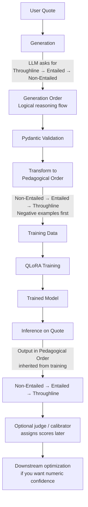

# Data Format Specification

Complete specification for the SPO reasoning training format.

## Overview

The repo uses structured triplets (subject-relation-object) throughout, but only generation-time records need numeric confidence. Training rows keep the evidence tags and drop static scores. This enables:
- **Non-Entailed Premises** — Premises that don't support the conclusion
- **Entailed Premises** — Premises that logically support the conclusion
- **Throughline** — The abductive hypothesis connecting premises to conclusion
- **Confidence calibration** (via SPO optimization)

## Data Flow: Generation vs Training vs Inference



## Three Stages: Generation vs Training vs Inference

### Stage 1: GENERATION (What we ask the LLM)

**Prompt Structure:**
```
Input:
"{quote}"

Completion: (Ask for as Pydantic keys and lists and/or N/A, in this order)
```
{completion}
```
```

**Generation Order (Logical Flow):**
```
Throughline:
  When one feels a premonition or intuitive sense, something bad is approaching.

Entailed Premises:
  - something | is (inferred, confidence=0.75) | wicked
  - something | is (inferred, confidence=0.8) | coming

Non Entailed Premises:
  - thumbs | are (observed, confidence=1.0) | pricking
```

**Why This Order for Generation?**
- **Throughline first**: LLM generates the hypothesis naturally
- **Entailed next**: LLM lists supporting evidence
- **Non-entailed last**: LLM identifies rejected candidates (negative inference)
- Matches human reasoning: conclusion → supporting evidence → what doesn't fit

**Example Full Generation:**
```
Input:
"By the pricking of my thumbs, Something wicked this way comes."

Completion:
```
Throughline:
  When one feels a premonition or intuitive sense, something bad is approaching.

Entailed Premises:
  - something | is (inferred, confidence=0.75) | wicked
  - something | is (inferred, confidence=0.8) | coming
  - premonition | signals (observed, confidence=1.0) | danger

Non Entailed Premises:
  - thumbs | are (observed, confidence=1.0) | pricking
  - sensation | causes (inferred, confidence=0.4) | physical pain
```
```

### Stage 2: TRAINING (What model learns)

**Transformation:** Reorder to **Pedagogical** order for better convergence

**Pedagogical Format** (Negative Examples First):
```
Non Entailed Premises:
  - thumbs | are (observed) | pricking
  - sensation | causes (inferred) | physical pain

Entailed Premises:
  - something | is (inferred) | wicked
  - something | is (inferred) | coming
  - premonition | signals (observed) | danger

Throughline:
  When one feels a premonition or intuitive sense, something bad is approaching.
```

**Training Record (JSONL):**
```json
{
  "input_text": "By the pricking of my thumbs, Something wicked this way comes.",
  "output_text": "Non Entailed Premises:\n  - thumbs | are (observed) | pricking\n  - sensation | causes (inferred) | physical pain\n\nEntailed Premises:\n  - something | is (inferred) | wicked\n  - something | is (inferred) | coming\n  - premonition | signals (observed) | danger\n\nThroughline:\n  When one feels a premonition or intuitive sense, something bad is approaching."
}
```

**Why Pedagogical Order for Training?**
- **Non-Entailed First** (Negative Examples) — Teaches discrimination (what to exclude)
- **Entailed Second** (Positive Examples) — Teaches support (what to include)
- **Throughline Last** (Conclusion) — Reinforces the reasoning pattern
- Better convergence than other orders
- Model learns: "First exclude irrelevant premises, then include relevant ones, then conclude"

### Stage 3: INFERENCE (What trained model produces)

**Given a new quote, model generates:**
```
Input:
"Call me Ishmael. I am a sailor."

Completion: (model outputs in learned pedagogical order)
```
Non Entailed Premises:
  - Ishmael | is (inferred) | fictional character
  - sailor | is (inferred) | wealthy

Entailed Premises:
  - person | is (observed) | narrator
  - narrator | has (inferred) | maritime experience
  - maritime experience | implies (inferred) | sea knowledge

Throughline:
  The narrator is establishing their identity as someone with extensive maritime knowledge and seafaring experience.
```
```

**Key Point:** Model outputs in pedagogical order (learned during training) — **NOT** generation order

**Post-hoc Scoring:**
- The base model emits premises + throughline without numeric confidence.
- If you want scores later, run an external judge or calibrator on the generated text.
- This keeps confidence permeable instead of freezing synthetic numerics into SFT labels.

## Triplet Structure

### Format
Generation-time structured records may use:
```
subject | relation (evidence_tag, confidence=X.XX) | object
```

Training and base inference use:
```
subject | relation (evidence_tag) | object
```

### Components

**Subject & Object**
- Any nominal entity: person, place, thing, property, event
- Example: "something", "premonition", "danger", "thumbs", "sailor"

**Relation**
- Predicate connecting subject to object
- Typically verb or verb phrase
- Example: "is", "causes", "signals", "implies", "has"

**Evidence Tag**
- **observed** (confidence = 1.0)
  - Explicit in the source text
  - Example: `thumbs | are (observed, confidence=1.0) | pricking`
  
- **inferred** (confidence ∈ [0.3, 0.9])
  - Derived from context, not explicit
  - Example: `something | is (inferred, confidence=0.85) | wicked`

**Confidence Score**
- Useful as an audit or judge-side field during synthetic generation
- Not part of the base training target
- Better treated as downstream metadata than as a static supervised label

## Pydantic Schema

```python
from pydantic import BaseModel
from typing import List

class TripletItem(BaseModel):
    subject: str
    relation: str
    object: str
    evidence_tag: str  # "observed" or "inferred"
    confidence: float  # 0.0-1.0

class ReasoningExample(BaseModel):
    quote: str
    throughline: str
    entailed_premises: List[TripletItem]
    non_entailed_premises: List[TripletItem]
```

### Generation Order (What LLM produces)
```python
# LLM returns triplets in this order for comprehension
{
    "quote": str,
    "throughline": str,
    "entailed_premises": List[TripletItem],      # Evidence supporting conclusion
    "non_entailed_premises": List[TripletItem]   # Candidates for negative inference
}
```

### Training Order (Transformed for learning)
```python
# Transform to pedagogical for training (negative examples first)
{
    "quote": str,
    "non_entailed_premises": List[TripletItem],  # Teach negatives FIRST
    "entailed_premises": List[TripletItem],      # Then positives
    "throughline": str                            # Finally conclusion
}
```

### Inference Order (What model learns to produce)
```python
# Model outputs in pedagogical order (inherited from training)
{
    "quote": str,
    "non_entailed_premises": List[TripletItem],  # Negative examples
    "entailed_premises": List[TripletItem],      # Supporting evidence
    "throughline": str                            # Conclusion
}
```

## Format Variants

### Generation Format (Logical Order)

**Purpose:** Natural reasoning flow when asking LLM to think

```
Throughline:
  The hypothesis...

Entailed Premises:
  - subject | relation (tag, conf=X) | object
  - subject | relation (tag, conf=Y) | object

Non Entailed Premises:
  - subject | relation (tag, conf=Z) | object
  - subject | relation (tag, conf=W) | object
```

**When to use:** LLM prompt for generating reasoning

### Training Format (Pedagogical Order)

**Purpose:** Optimized for model learning via contrastive examples

```
Non Entailed Premises:
  - subject | relation (tag, conf=Z) | object
  - subject | relation (tag, conf=W) | object

Entailed Premises:
  - subject | relation (tag, conf=X) | object
  - subject | relation (tag, conf=Y) | object

Throughline:
  The hypothesis...
```

**When to use:** Training data (QLoRA fine-tuning)

### Inference Format (Trained Habit)

**Purpose:** Model outputs in learned pedagogical order

```
Non Entailed Premises:
  - subject | relation (tag, conf=Z) | object
  - subject | relation (tag, conf=W) | object

Entailed Premises:
  - subject | relation (tag, conf=X) | object
  - subject | relation (tag, conf=Y) | object

Throughline:
  The hypothesis...
```

**When to use:** Model inference outputs (after training — inherited order)

## Confidence NOT in Training Data

**Critical Design Decision:**
- Training data specifies confidence scores for reference
- But model DOES NOT learn these as targets
- Confidence emerges naturally during inference
- SPO then optimizes the emergent confidence

**Why?**
- Prevents confidence overfitting to training labels
- Enables better transfer to new domains
- Confidence represents true uncertainty, not memorized values

## SPO Policy (Optimization Phase)

After training, the model generates triplets with emergent confidence. SPO optimizes this confidence.

### Reward Calculation

```python
def spo_reward(
    prediction: str,  # Model output with triplets + confidence
    reference: str,   # Gold-standard reasoning
    correctness_score: float  # 0.0 to 1.0 (LLM judgment or metric)
) -> float:
    # Extract confidence from model output
    pattern = r'confidence=([0-9.]+)'
    scores = [float(m.group(1)) for m in re.finditer(pattern, prediction)]
    avg_confidence = sum(scores) / len(scores) if scores else 0.0
    
    # Reward = correctness × confidence
    reward = correctness_score * avg_confidence
    
    return reward
```

### Reward Semantics

```
reward = correctness × confidence

If correctness=1.0, confidence=0.9 → reward=0.9 (HIGH)
If correctness=1.0, confidence=0.5 → reward=0.5 (MEDIUM)
If correctness=0.0, confidence=0.9 → reward=0.0 (PENALIZED)
If correctness=0.0, confidence=0.1 → reward=0.0 (PENALIZED)
```

**Goal:** Model learns to be confident when correct and uncertain when wrong

### Training Loop

```python
from src.spo_trainer import SPOTrainer, SPOReward

# Create reward model
reward = SPOReward(
    model=trained_model,
    tokenizer=tokenizer,
    correctness_threshold=0.7
)

# Create SPO trainer
trainer = SPOTrainer(
    model=trained_model,
    reward_fn=reward,
    learning_rate=1e-5,
    num_epochs=3
)

# Optimize
trainer.train(dataset)
```

### Correctness Scoring

Correctness can be judged by:
1. **LLM Judge** — Another model evaluates correctness
2. **Structured Match** — Does output match reference structure?
3. **Semantic Similarity** — BERTScore or cosine similarity
4. **Manual Labels** — Ground truth from humans

## Validation

All training records must pass Pydantic validation:

```python
from pydantic import ValidationError

try:
    example = ReasoningExample(
        quote=quote_text,
        throughline=conclusion,
        entailed_premises=entailed,
        non_entailed_premises=non_entailed
    )
except ValidationError as e:
    print(f"Invalid record: {e}")
    # Discard — never write with defaults
```

Invalid records are **DISCARDED**, never written with fallback values.

## Deterministic Ordering

For reproducible training, sort triplets deterministically:

```python
# Hard-code sort key before serializing
records.sort(key=lambda r: (
    r.avg_char_pos,       # Position in original text
    r.sentence_index,     # Sentence number
    r.triplet_index       # Triplet order within sentence
))

# avg_char_pos computed on original pre-cleaning text
avg_char_pos = original.find(sentence) + len(sentence) / 2
```

## Token Length Filtering

When records vary materially in token length, filter using Box-Cox transform:

```python
import numpy as np
from scipy import stats

# Tokenize records
tokens_per_record = [len(tokenizer.encode(r)) for r in records]

# Log-normalize and transform
log_lengths = np.log1p(tokens_per_record)
transformed, lambda_param = stats.boxcox(log_lengths)

# Compute robust center
median_transformed = np.median(transformed)
mad = stats.median_abs_deviation(transformed)

# Keep records within median ± 2*MAD
keep_idx = np.abs(transformed - median_transformed) <= 2 * mad
filtered = [r for i, r in enumerate(records) if keep_idx[i]]

print(f"Kept {len(filtered)}/{len(records)} records (within MAD bounds)")
```

Result: Removes extremely long/short records while preserving distribution

## Integration Pipeline

### Generation → Validation → Training → Inference

```
User Quotes
    ↓
[Generate via LLM]  (Logical order)
    ↓
[Validate with Pydantic]
    ↓
[Transform to Pedagogical]
    ↓
[Export to JSONL]
    ↓
[QLoRA Training]
    ↓
[Model learns pedagogical order]
    ↓
[Inference on new quotes]
    ↓
[Extract confidence]
    ↓
[SPO Optimization]
    ↓
[Calibrated confidence model]
```

## Examples

### Complete Generation → Training → Inference Cycle

**Generation (Logical):**
```
Input:
"By the pricking of my thumbs, Something wicked this way comes."

Completion:
```
Throughline:
  When one feels a premonition, something wicked or dangerous approaches.

Entailed Premises:
  - premonition | signals (observed, confidence=1.0) | danger
  - something | is (inferred, confidence=0.85) | wicked

Non Entailed Premises:
  - thumbs | are (inferred, confidence=0.3) | sore
```
```

**Training (Pedagogical):**
```json
{
  "input_text": "By the pricking of my thumbs, Something wicked this way comes.",
  "output_text": "Non Entailed Premises:\n  - thumbs | are (inferred, confidence=0.3) | sore\n\nEntailed Premises:\n  - premonition | signals (observed, confidence=1.0) | danger\n  - something | is (inferred, confidence=0.85) | wicked\n\nThroughline:\n  When one feels a premonition, something wicked or dangerous approaches."
}
```

**Inference (Pedagogical — learned from training):**
```
Input:
"Beware the Ides of March."

Completion:
```
Non Entailed Premises:
  - calendar | has (inferred, confidence=0.2) | religious significance

Entailed Premises:
  - warning | signals (observed, confidence=1.0) | caution
  - caution | indicates (inferred, confidence=0.88) | danger
  - danger | is (inferred, confidence=0.92) | impending

Throughline:
  A specific date carries historical and ominous significance as a warning of impending danger.
```
```

**SPO Optimization:**
```
Extracted confidence: [0.2, 1.0, 0.88, 0.92]
Average: 0.75
If correctness=0.9 → reward = 0.9 × 0.75 = 0.675
Model learns this is good prediction (high correctness, reasonable confidence)
```

## References

- Pydantic schema: `src/synthetic_generator.py`
- SPO trainer: `src/spo_trainer.py`
- Data pipeline: `src/pipeline.py`
- Format configuration: `src/training_config.py`
- Examples: `data/SEEING_IS_BELIEVING_EXAMPLES.md`
- Architecture guide: `docs/architecture/README.md`


---

## Synthetic generation -> training example

The same quote moves through a few different shapes before it becomes a training row.

### 1. Synthetic generation scaffold

```text
Input:
"By the pricking of my thumbs, Something wicked this way comes."

Completion:
Throughline:
  When one feels a premonition or intuitive sense, something bad is approaching.

Entailed Premises:
  - something | is (inferred) | wicked
  - something | is (inferred) | coming

Non-Entailed Premises:
  - thumbs | are (observed) | pricking
```

### 2. Preprocessed structured record

The preprocessing step strips hybrid markdown wrappers, extracts named sections, normalizes missing values, and turns the scaffold into a clean structured record:

```json
{
  "quote": "By the pricking of my thumbs, Something wicked this way comes.",
  "entailed_premises": [
    "something | is (inferred) | wicked",
    "something | is (inferred) | coming"
  ],
  "non_entailed_premises": [
    "thumbs | are (observed) | pricking"
  ],
  "syllogism": "When one feels a premonition or intuitive sense, something bad is approaching."
}
```

### 3. Training row actually fed to the model

The serializer then converts that structured record into the pedagogical training format used for QLoRA. The base regimen now uses an explicit task prompt plus chat-formatted supervision so the instruct model sees the same contract at train and inference time. Evidence tags stay; numeric confidence is stripped so the base model learns premises and throughline text rather than frozen scores:

```text
Given this quote, extract the implicit reasoning.

Quote: "By the pricking of my thumbs, Something wicked this way comes."

Generate a response with:
1. Non-Entailed Premises
2. Entailed Premises
3. Throughline

Format each premise as: subject | relation (tag) | object
- tag: "observed" for explicit facts, "inferred" for derived facts

Response:

Non-Entailed Premises:
thumbs | are (observed) | pricking

Entailed Premises:
something | is (inferred) | wicked
something | is (inferred) | coming

Throughline:
When one feels a premonition or intuitive sense, something bad is approaching.
```


---

## Why the format matters

The core design choice is that the repo uses different orders for different stages of the pipeline.

| Stage | Order | Why |
|---|---|---|
| Generation | Throughline -> Entailed -> Non-Entailed | Natural reasoning flow for the generating LLM |
| Training | Non-Entailed -> Entailed -> Throughline | Negative inference first; better contrastive signal |
| Inference | Non-Entailed -> Entailed -> Throughline | The model tends to emit what it was taught |

This matters because the training target is not just "state the answer." It teaches the model what does **not** support the conclusion before teaching what does. That is the job of **non-entailed premises**.

For the full specification, examples, and exact `Input` / `Completion` layout, read `docs/format/README.md`.
